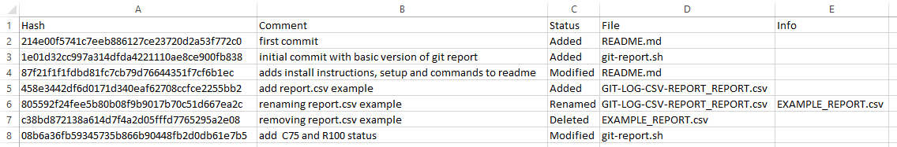
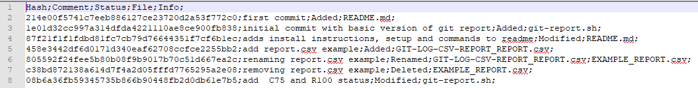

# Git Log CSV Report
###### With one command, generate a .csv file of your entire commit history. A great way to remind you of your previous work. You can filter by author and comment too :)

## Example report




## Install instructions
Copy the `git-report.sh` to the git repository folder.

## Setup
Make sure you are working in a git repository that has **at least one commit**.

##### You can set the user and comment filters in the `git-report.sh` file:
```
# Filters
USER_FILTER="Paloma\|Claudino"
COMMENT_FILTER=""
```

## Commands
Run on current git repository with `$ sh ./git-report.sh`

## Contact
- [Paloma Claudino](mailto:paloma.claud@gmail.com)
- [@palomaclaud](http://github.com/palomaclaud)
